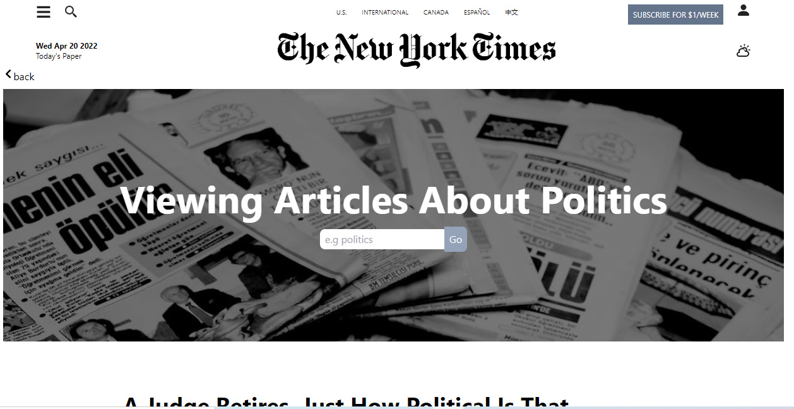

# Nytimes app
A clone application of the New York Times websites.

## Table of contents
* [General info](#general-info)
* [Technologies](#technologies)
* [Usage](#usage)
* [Illustrations](#illustrations)
* [Link](#illustrations)
* [Contributing](#contributing)

## General info
The New York Times web app is an American daily newspaper based in New York City. This application is a clone application of the New York Times using three (3) of the nytimes api (Article Search API, Most Popular API and Top Stories API).
	
## Technologies
Project is created with:
* React
* JavaScript
* HTML
* CSS
	
## Usage
The Homepage displays the fetched data showing Live news and top stories which clicking on any link opens up the page of the link. The search icon opens up the search page when clicked and entrying any word in the search bar displays all related news.

## Illustrations
    

## Links
Link to App:
https://og-library.netlify.app/
Link to Github:
https://github.com/oglili/library

## Contributing
Pull requests are welcome. For major changes, please open an issue first to discuss what you would like to change.

Please make sure to update tests as appropriate.
